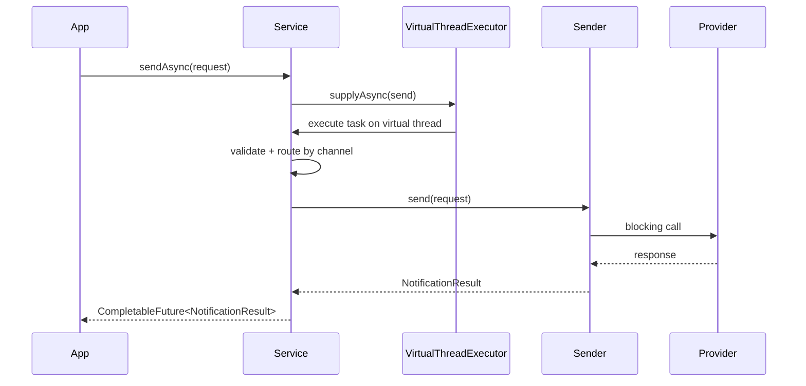

# Notifications Library

Libreria Java 21 multi-modulo para enrutar notificaciones por canal: `EMAIL`, `SMS` y `PUSH`.

Incluye:
- `notifications-core` con modelos de entrada/salida y el puerto `NotificationSender`.
- `notifications-application` con el servicio central de envio y el builder.
- `notifications-adapters` con providers de ejemplo por canal.
- `notifications-demo` con las dos variantes de ejecucion:
  - `com.demo.notifications.examples.NotificationExamples` para el flujo sin optimizacion.
  - `com.demo.notifications.examples.NotificationOptimizedMain` para el flujo optimizado con virtual threads.

## Requisitos

- Java 21
- Maven 3.9+

## 1. Compilar el proyecto

```bash
mvn clean test
mvn package
```

El artefacto ejecutable queda en:

```bash
notifications-demo/target/notifications-demo-1.0.0.jar
```

## 2. Consumir la libreria como dependencia

1. Instala el artefacto en tu repositorio local.

```bash
mvn install
```

2. Agrega las dependencias del modulo que vas a consumir.

```xml
<dependency>
    <groupId>com.demo</groupId>
    <artifactId>notifications-core</artifactId>
    <version>1.0.0</version>
</dependency>
<dependency>
    <groupId>com.demo</groupId>
    <artifactId>notifications-application</artifactId>
    <version>1.0.0</version>
</dependency>
```

Si quieres reutilizar los providers de ejemplo, agrega tambien `notifications-adapters`.

```xml
<dependency>
    <groupId>com.demo</groupId>
    <artifactId>notifications-adapters</artifactId>
    <version>1.0.0</version>
</dependency>
```

3. Crea el servicio y registra los remitentes.

```java
import com.demo.notifications.core.NotificationRequest;
import com.demo.notifications.core.NotificationResult;
import com.demo.notifications.core.enums.NotificationChannel;
import com.demo.notifications.providers.email.impl.GridEmailSender;
import com.demo.notifications.providers.email.impl.MailgunEmailSender;
import com.demo.notifications.providers.push.impl.FirebasePushSender;
import com.demo.notifications.providers.sms.impl.TwilioSmsSender;
import com.demo.notifications.services.NotificationService;
import com.demo.notifications.services.NotificationServiceBuilder;

NotificationService service = new NotificationServiceBuilder()
    .register(new GridEmailSender(
        "demo-sendgrid-api-key",
        "demo.mail.example",
        "noreply@demo.mail.example"))
    .register(new MailgunEmailSender(
        "demo-mailgun-api-key",
        "demo.mail.example",
        "noreply@demo.mail.example"))
    .register(new TwilioSmsSender(
        "demo-twilio-token",
        "AC1234567890",
        "+15551234567"))
    .register(new FirebasePushSender(
        "demo-firebase-api-key",
        "demo-project",
        "service-account.json"))
    .activeProvider(NotificationChannel.EMAIL, "SendGrid")
    .build();
```

4. Construye la solicitud y envia la notificacion.

```java
NotificationResult result = service.send(
    NotificationRequest.email(
        "user@example.com",
        "Bienvenido",
        "Tu cuenta esta lista."));
```

5. Si quieres envio asincrono, usa `sendAsync(...)` o `sendBatchAsync(...)`.

```java
try (var executor = java.util.concurrent.Executors.newVirtualThreadPerTaskExecutor()) {
    NotificationService service = new NotificationServiceBuilder()
        .executor(executor)
        .register(new GridEmailSender("api-key", "demo.example", "noreply@demo.example"))
        .build();

    NotificationResult result = service.sendAsync(
        NotificationRequest.sms(
            "+573001234567",
            "Tu codigo es 123456")).join();
}
```

> Nota: `NotificationServiceBuilder` usa virtual threads por defecto. Si quieres un comportamiento sin optimizacion, puedes pasar un executor sincronico como `Runnable::run`.

> Nota: si registras mas de un provider para el mismo canal, puedes definir el provider activo con `activeProvider(...)` o una cadena de fallback con `fallbackProviders(...)`. Si solo registras uno, se usa automaticamente.
> Nota: el modulo `notifications-demo` es el que genera el jar ejecutable.

## 3. Variante sin optimizacion

La clase `NotificationExamples` usa un executor directo y ejecuta el flujo de forma sincronica.

Ejecutar:

```bash
java -cp notifications-demo/target/notifications-demo-1.0.0.jar com.demo.notifications.examples.NotificationExamples --channel=email --to=user@example.com --subject=Bienvenido --message="Tu cuenta esta lista."
```

## 4. Variante optimizada con virtual threads

La clase `NotificationOptimizedMain` crea un `ExecutorService` con `Executors.newVirtualThreadPerTaskExecutor()` y ademas configura una cadena de fallback para `EMAIL`.

En esta variante:
- Cada peticion corre en un virtual thread independiente.
- El canal puede usar seleccion explicita con `activeProvider(...)` o fallback ordenado con `fallbackProviders(...)`.
- El envio se hace con `sendAsync(...).join()`.

```java
try (var executor = Executors.newVirtualThreadPerTaskExecutor()) {
    NotificationService service = new NotificationServiceBuilder()
        .executor(executor)
        .register(...)
        .register(...)
        .fallbackProviders(NotificationChannel.EMAIL, "SendGrid", "Mailgun")
        .build();

    NotificationResult result = service.sendAsync(request).join();
}
```

### Flujo


Ejecutar:

```bash
java -jar notifications-demo/target/notifications-demo-1.0.0.jar --channel=sms --to=+573001234567 --message="Tu codigo es 123456"
```

## 5. Parametros de entrada

| Parametro | Alias | Requerido | Aplica a | Descripcion |
| --- | --- | --- | --- | --- |
| `--channel` | `-c` | Si | Todos | Canal a usar: `email`, `sms` o `push`. |
| `--to` | `-t` | Si | Todos | Destinatario, numero de telefono o token. |
| `--message` | `-m` | Si | Todos | Mensaje principal a enviar. |
| `--subject` | `-s` | No | `email` | Asunto del correo. |
| `--title` | `-l` | No | `push` | Titulo de la notificacion push. |
| `--help` | `-h` | No | Todos | Muestra la ayuda de uso. |

### Ejemplos

Email:

```bash
java -jar notifications-demo/target/notifications-demo-1.0.0.jar --channel=email --to=user@example.com --subject=Bienvenido --message="Tu cuenta esta lista."
```

SMS:

```bash
java -jar notifications-demo/target/notifications-demo-1.0.0.jar --channel=sms --to=+573001234567 --message="Tu codigo es 123456."
```

Push:

```bash
java -jar notifications-demo/target/notifications-demo-1.0.0.jar --channel=push --to=push-token-123456 --title="Nuevo mensaje" --message="Recibiste una notificacion."
```

## 6. Comportamiento interno

- El canal se resuelve por `request.channel()`.
- El sender se busca en un `EnumMap`, asi que el ruteo es de costo constante.
- La capa optimizada no cambia el canal ni el contrato de entrada, solo cambia el executor que atiende la peticion.
- Un mismo canal puede tener varios providers registrados.
- El provider activo se define por configuracion en el builder con `activeProvider(...)`.
- Si un canal tiene varios providers y no se selecciona uno activo ni una politica de fallback, la construccion del servicio falla para evitar ambiguedad.
- Si defines `fallbackProviders(...)`, la libreria intenta los providers en el orden configurado hasta que uno responde con exito.

## 7. Estado actual de los sender examples

Las clases incluidas en `providers` son implementaciones de ejemplo. Registran resultados y sirven para probar el flujo de la libreria, pero no llaman APIs reales de terceros.

Si necesitas integraciones productivas, reemplaza esas clases por adaptadores que invoquen tus proveedores reales.

## 8. Uso con Docker

El `Dockerfile` del repositorio construye el modulo `notifications-demo` y empaqueta el jar ejecutable en una imagen ligera.

Construir la imagen:

```bash
docker build -t notifications-demo .
```

Ejecutar un ejemplo:

```bash
docker run --rm notifications-demo --channel=email --to=user@example.com --subject=Bienvenido --message="Tu cuenta esta lista."
```

Si necesitas probar otro flujo, solo cambia los argumentos:

```bash
docker run --rm notifications-demo --channel=sms --to=+573001234567 --message="Tu codigo es 123456"
```

Nota: esta imagen esta pensada para compartir y ejecutar el demo compilado. Para consumo como dependencia Java, sigue siendo mejor publicar los jars de Maven o instalar el parent multi-modulo en un repositorio interno.
